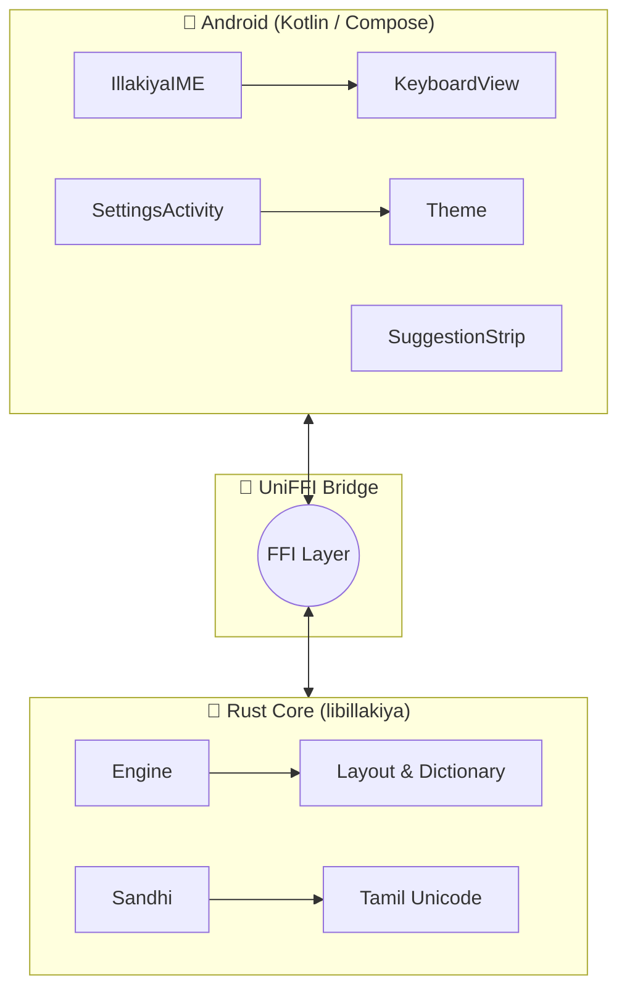

<div align="center">
  <h1>✨ Illakiya (இலக்கிய) ✨</h1>
  <p><b>A native Tamil keyboard for Android, built with Rust + Kotlin.</b></p>
  
  [](https://android.com)
  [](https://rust-lang.org)
  [](https://kotlinlang.org)
  
  > *Named after the Tamil word for "literature" (இலக்கியம்), Illakiya brings the elegance of Sangam poetry to modern mobile input.*

See [NEXT_ACTION.md](./NEXT_ACTION.md) for the roadmap, **October 2026 Pilot**, and **December 2026 Launch** deliverables.

</div>

---

## 🏗️ Architecture



## ✨ Features

- 🎹 **PM0100 Layout** — Phonetically grouped Tamil keyboard based on *Tholkaappiyam*
- 🔠 **247 Tamil Characters** — All 12 vowels, 18 consonants, 216 combinations, and ayutham
- 👆 **Nedil Swipe** — Swipe up for long vowels (குறில் → நெடில்)
- 📖 **Lightning Fast Dictionary** — 836 words with Trie-based prefix search (`<5ms` latency)
- 🧠 **Sandhi Engine** — 6 Tholkaappiyam Punarchi rules with confidence scoring
- 🎨 **Sangam Theme** — Stunning UI inspired by Tamil literary landscapes (குறிஞ்சி, முல்லை, நெய்தல், பாலை, மருதம்)
- 🗜️ **Zero Filesystem** — All data safely embedded in binary via `include_str!`

## 🚀 Quick Start

```bash
# Build APK (requires Android SDK + NDK + Rust)
./scripts/build-apk.sh

# Install to connected device
adb install android/app/build/outputs/apk/debug/app-debug.apk
```

## 📚 Dictionary Sources

| Source | Words | Description |
|--------|-------|-------------|
| **Swadesh + Common** | 247 | Base vocabulary |
| **Sangam Corpus** | 413 | Project Madurai mining (36K unique words scanned) |
| **Modern Tamil** | 30 | Education, government, society |
| **Verbs** | 22 | Common conjugations |
| **Grammar** | 21 | Pronouns, particles, postpositions |
| **Tanglish** | 20 | Borrowed English, colloquial terms |
| **Tech** | 17 | Software, apps, internet |
| **Literary** | 20 | Tinai, turai, Sangam terms |
| **Body & Nature** | 25 | Anatomy, weather, flora |
| **Corpus Frequent** | 21 | High-frequency literary terms |

## 🎨 Sangam Theme Palette

| Color | Name | Hex | Inspiration |
|-------|------|-----|-------------|
| 🔴 **Primary** | `KurunthogaiRed` | `#8B2500` | Kurunthogai love poems |
| 🟤 **Surface** | `MullaiSoil` | `#3E2723` | Forest earth |
| 🟡 **Accent** | `PalaiSand` | `#D4A574` | Desert landscape |
| 🔵 **Dark** | `KurinjiNight` | `#1A1A2E` | Mountain twilight |

## 💻 Tech Stack

- **Kotlin** — Android UI (Jetpack Compose, Material 3)
- **Rust** — Core engine (state machine, dictionary, sandhi)
- **UniFFI** — FFI bridge (Mozilla, type-safe)
- **JNA** — Java Native Access (runtime FFI loader)

---

## 📜 License & Open Source

Part of the [Yazhi](https://github.com/yazhi-lem) open source ecosystem.  
FLOSS-first. Community-driven. Tamil-powered.

<div align="center">
  <b>வாழ்க தமிழ்! — Long live Tamil!</b>
</div>
